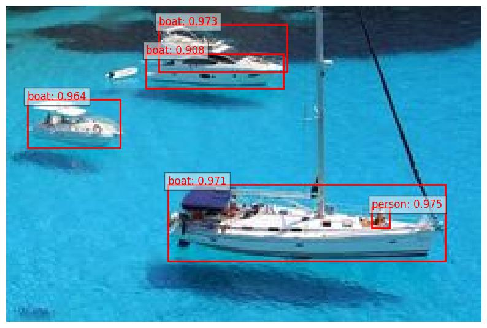

# DETRを用いた物体検出


## モデル詳細

| モデル名       | facebook/detr-resnet-50                   |
|-------------|---------------------------|
| バックボーン    | ResNet-50                     |
| 入力サイズ| 任意|
|事前学習データ|COCO 2017 dataset|
|出力オブジェクト数|最大 100 個|
|推論速度|約 30 FPS（V100 GPU）|
|出力情報|クラスラベル + バウンディングボックス (x, y, width, height)|

## object_detection_image.py
DETRで実装されている既存の物体検出を推論。物体検出結果を画像ごとにバウンディングボックスが記載された画像を出力

### 実行方法

推論する画像フォルダを指定
```
image_folder_path = "folder_path"  #画像フォルダ
```
結果保存先のファルダを指定
```
output_folder_path = "folder_path"  #出力先
```
アルファ値
アルファ値以上の検出された物体を結果で表示(現在はalpha=0.5)
```
ax.text(box[0], box[1], f"{model.config.id2label[label.item()]}: {round(score.item(), 3)}", color="red", fontsize=12, bbox=dict(facecolor="white", alpha=0.5))
```

実行
```
python3 object_detection_image.py 
```

結果表示



## object_detection_txt.py
DETRで実装されている既存の物体検出を推論。物体検出結果を画像ごとに検出した物体とその数をカウント

### 実行方法

推論する画像フォルダを指定
```
image_folder_path = "folder_path"  #画像フォルダ
```
結果保存先のファルダを指定
```
output_folder_path = "folder_path"  #出力先
```

しきい値以上の物体をカウント(現在はthreshold=0.9)
```
results = processor.post_process_object_detection(outputs, target_sizes=target_sizes, threshold=0.9)[0]
```

実行
```
python3 object_detection_txt.py
```

結果表示
```
Image: sample.jpg
Detected objects and their counts:
  boat: 4
  person: 1
```
